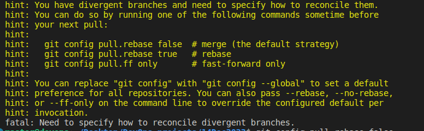
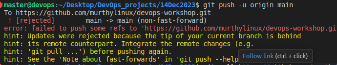

Step 01:
-------

Creating the local repo and push the content to remote repo.

# Create a new repository on the command line
 
touch README.md
git init
git add README.md
git commit -m "first commit"
git remote add origin https://github.com/murthylinux/devops-workshop.git
git push -u origin main
 
# Push an existing repository from the command line
 
git remote add origin https://github.com/murthylinux/devops-workshop.git
git push -u origin main

# Troubleshoot of Issues

> git push -u origin main 
 
 > git config pull.rebase false

Finally command: 
---------------
Note: 
The -f is actually required because of the rebase. Whenever you do a rebase you would need to do a force push because the remote branch cannot be fast-forwarded to your commit. You'd always want to make sure that you do a pull before pushing, but if you don't like to force push to master or dev for that matter, you can create a new branch to push to and then merge or make a PR.

----
git push -fu origin main
----

git push -fu origin main 
  

Step 02:
-------

# Creating VPC will all the parameters for AWS:

# Step by Step of VPC Creation along with EC2 Instances:
 
 1. provider = aws
 2. VPC 
 3. Public_Subnet inside VPC
 4. Private_Subnet inside VPC
 5. Internet Gateway
 6. NAT Gateway
 7. Elastic IP for NAT
 8. Route table for Public Subnets
 9. Route table for Private Subnets
 10. Configure public route to use internet gateway for internet access
 11. Configure private route to use NAT gateway for internet access
 12. Associate route tables for subnets.
 13. Public EC2 creation
 14. Private EC2 creation. 

The following page is having all the details of the Terraform:

https://javatodev.com/how-to-build-aws-vpc-using-terraform-step-by-step/
